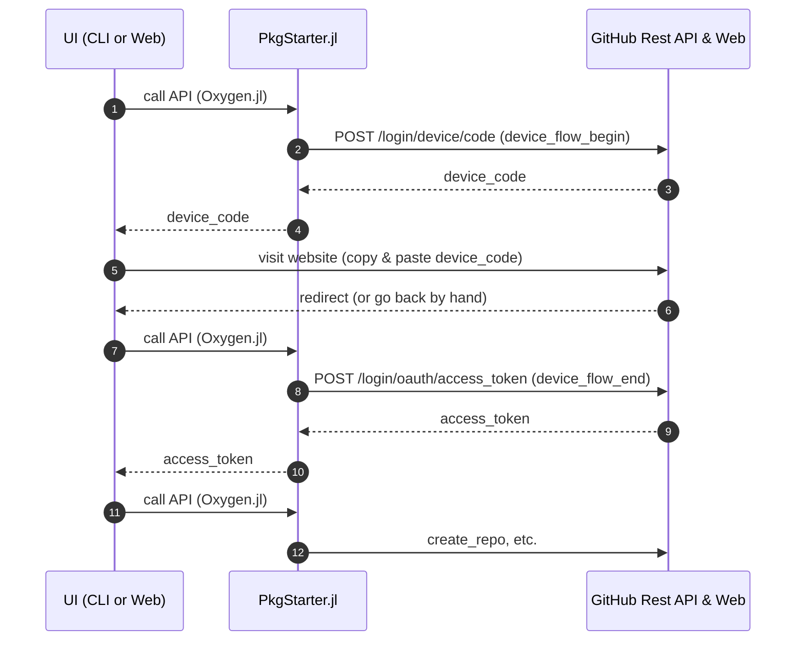

# Developer Guide

This page describes how to develop PkgStarter.jl locally (tests, docs, and common maintenance tasks). For feature requests or behavior changes, please open an Issue first to discuss motivation, use-cases, and compatibility. Once we agree on the direction, PRs are welcome.

Generate Documentation:

```sh
julia --project=docs --startup-file=no -e 'using Pkg; Pkg.develop(PackageSpec(path=pwd())); Pkg.instantiate();'
julia --project=docs --startup-file=no -e 'include("docs/make.jl")'
```

Run Tests:

```sh
julia --project=. --startup-file=no -e 'using Pkg; Pkg.test()'
```

Dependency Maintenance:

```sh
julia --project=. -e 'import Pkg; Pkg.update()'
julia --project=. -e 'import Pkg; Pkg.resolve()'
julia --project=. -e 'import Pkg; Pkg.instantiate()'
```

Development REPL (with Revise):

```sh
julia -i -E 'using Revise; import Pkg; Pkg.activate("."); using PkgStarter; PkgStarter.hello()'
```

OAuth Device Flow Sequence Diagram:

